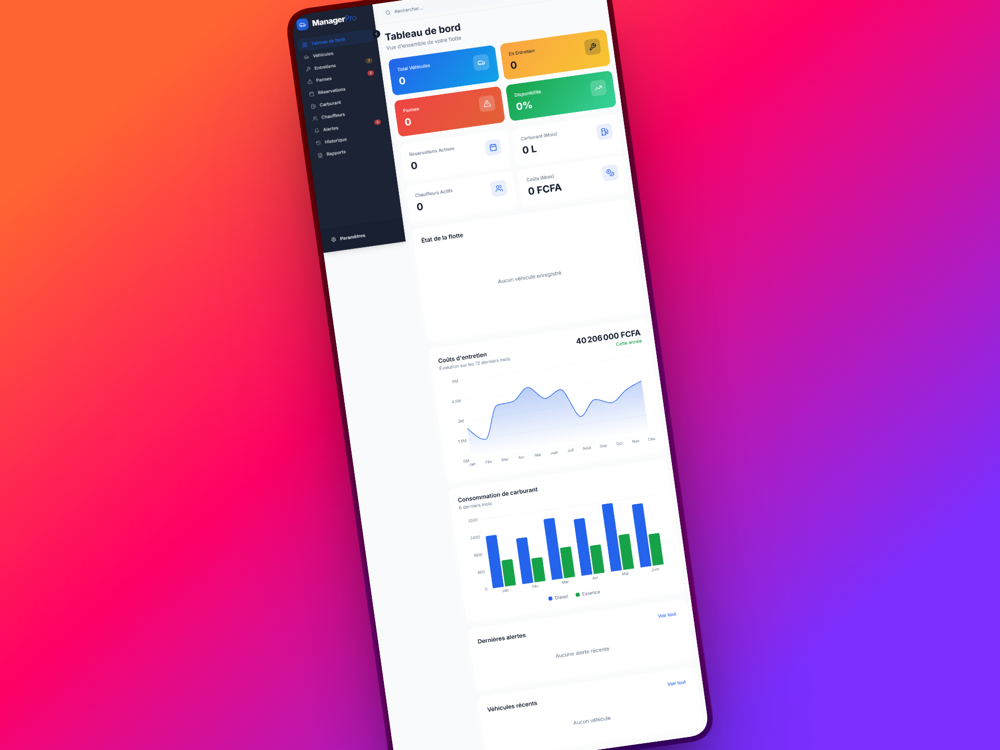

# 🚗 Fleet Commander (Manager Pro)

> **Application web professionnelle de gestion complète et de suivi opérationnel de flotte de véhicules.**

[](https://manager-pro-weld.vercel.app/)
[](https://reactjs.org/)
[](https://www.typescriptlang.org/)
[](https://vitejs.dev/)
[](https://tailwindcss.com/)
[](https://supabase.com/)
[](LICENSE)

---



---

## 🌟 Présentation

**Fleet Commander** est une solution moderne de gestion de flotte automobile conçue pour les gestionnaires de parc, entreprises et administrateurs logistiques. L'application centralise la gestion des véhicules, chauffeurs, réservations, entretiens, pannes et consommations de carburant au sein d'une interface fluide, intuitive et réactive.

🔗 **Accès direct à l'application déployée :** [https://manager-pro-weld.vercel.app/](https://manager-pro-weld.vercel.app/)

📖 **Étude de cas détaillée & Rapport d'ingénierie :** [Consulter le rapport complet](./RAPPORT_ETUDE_DE_CAS.md)

---

## 🚀 Fonctionnalités Clés

- 📊 **Tableau de bord avec KPIs en temps réel :** Vue synthétique sur la disponibilité de la flotte, les coûts mensuels, le carburant consommé, les alertes urgentes et les répartitions graphiques interactives.
- 🚘 **Gestion du parc de véhicules & des chauffeurs :** Fiches complètes avec photos, kilométrages, statuts opérationnels (*Disponible, En mission, En panne, En entretien*) et suivi des permis de conduire avec dates d'expiration.
- 📅 **Planning des réservations & missions :** Affectation de véhicules et conducteurs avec suivi du cycle de validation (*En attente, Confirmée, Terminée, Annulée*).
- 🔧 **Suivi de la maintenance & pannes :** Programmation des révisions périodiques, déclaration d'incidents avec niveaux de sévérité (*Faible à Critique*), traçabilité des résolutions et des factures de réparation.
- ⛽ **Gestion du carburant & dépenses :** Relevés des pleins, calcul des consommations moyennes, suivi des stations et maîtrise budgétaire.
- 🔔 **Système d'alertes automatiques :** Notifications proactives pour les révisions kilométriques/temporelles à venir et les permis arrivant à expiration.
- 📄 **Exports & Rapports automatisés :** Génération instantanée de rapports PDF stylisés (`jsPDF`) et de fichiers Excel (`xlsx`) par domaine métier.
- 🌐 **Internationalisation & Préférences régionales :** Support multilingue natif (Français, Anglais, Espagnol), choix des devises (**FCFA, EUR, USD**) et unités de distance (**km / miles**).

---

## 🛠️ Stack Technique

| Domaine | Technologies & Librairies |
| :--- | :--- |
| **Frontend** | React 18, TypeScript, Vite |
| **Styling & UI** | Tailwind CSS, Radix UI (Shadcn/UI), Lucide React |
| **Data Viz & Graphiques** | Recharts |
| **Gestion d'état & Requêtes** | TanStack React Query v5 |
| **Formulaires & Validation** | React Hook Form, Zod |
| **Backend & Base de données** | Supabase (PostgreSQL, Supabase Auth, Storage, Row Level Security - RLS) |
| **Internationalisation** | i18next, react-i18next, i18next-browser-languagedetector |
| **Génération & Exports** | jsPDF, jspdf-autotable, XLSX (SheetJS), date-fns |

---

## 🏗️ Architecture Technique Notable

Le projet met en œuvre une **couche de services découplée et agnostique du backend** via le pattern *Adapter* :

- **`src/services/api/adapter.ts`** : Définit le contrat d'interface `DatabaseAdapter` et les sous-adaptateurs (`AuthAdapter`, `VehicleAdapter`, `MaintenanceAdapter`, `FuelLogAdapter`, `AlertAdapter`, etc.).
- **`src/services/supabase/adapter.ts` & `mappers.ts`** : Fournit l'implémentation concrète Supabase avec transformation bidirectionnelle des données.
- **`src/services/index.ts`** : Point d'accès centralisé injecté dans les hooks React Query (`useVehicles`, `useMaintenance`, etc.).

> 💡 **Bénéfice :** Cette architecture permet de maintenir une isolation totale entre la logique d'affichage et la persistance. Le backend peut ainsi être remplacé par une API REST personnalisée, GraphQL ou un autre BaaS sans modifier les composants ni les hooks de l'application.

---

## 💻 Installation & Lancement en Local

### Prérequis
- [Node.js](https://nodejs.org/) (version 18 ou supérieure recommandée)
- [npm](https://www.npmjs.com/) ou [bun](https://bun.sh/)
- Un compte [Supabase](https://supabase.com/) (pour configurer la base PostgreSQL et les clés d'API)

### Étapes

1. **Cloner le repository :**
   ```bash
   git clone https://github.com/netwavestudioweb-creator/Manager_Pro.git
   cd Manager_Pro
   ```

2. **Installer les dépendances :**
   ```bash
   npm install
   ```

3. **Configurer les variables d'environnement :**
   Créez un fichier `.env` à la racine du projet :
   ```env
   VITE_SUPABASE_URL=https://votre-projet.supabase.co
   VITE_SUPABASE_ANON_KEY=votre-cle-anon-supabase
   ```

4. **Lancer le serveur de développement :**
   ```bash
   npm run dev
   ```
   L'application sera accessible sur `http://localhost:5173`.

5. **Compiler pour la production :**
   ```bash
   npm run build
   ```

6. **Prévisualiser le build de production :**
   ```bash
   npm run preview
   ```

---

## 🔒 Sécurité & Contrôle d'Accès (RBAC)

L'application intègre une gestion sécurisée des accès basée sur les rôles :
- **Admin :** Accès complet (lecture, écriture, configuration, suppression).
- **Gestionnaire :** Gestion opérationnelle du parc (création/modification des véhicules, entretiens, missions, carburant).
- **Lecteur :** Consultation des tableaux de bord et rapports en lecture seule.

La sécurité est assurée à la fois côté client via `ProtectedRoute` et côté base de données grâce aux politiques **Row Level Security (RLS)** de PostgreSQL sous Supabase.

---

## 🌐 Déploiement

L'application est déployée en continu sur **Vercel** :
- **URL de production :** [https://manager-pro-weld.vercel.app/](https://manager-pro-weld.vercel.app/)

---

## 📄 Licence

Ce projet est sous licence [MIT](LICENSE).
